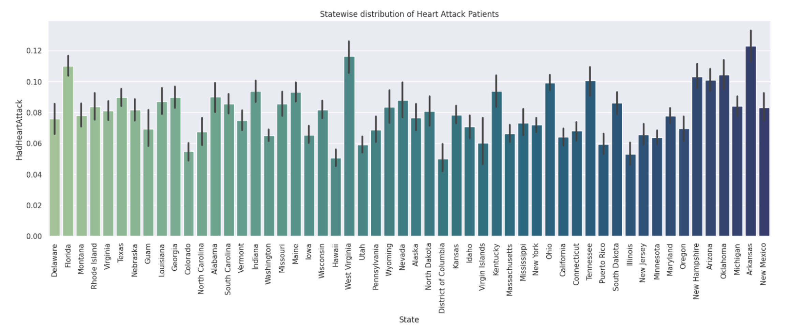

# Heart-Disease-Indicator


## Overview

The dataset used in this project contains various health-related attributes of U.S. residents. The analysis includes data cleaning, handling missing values, encoding categorical variables, and applying machine learning models to predict the risk of heart disease.

This project aims to determine the relationship between the health status of U.S. residents and their risk of having a heart attack. Our objective is to classify whether a person is having a heart attack or not and to see how the demographics of the people affected by heart attacks. The
[Indicators of Heart Disease](https://www.kaggle.com/datasets/kamilpytlak/personal-key-indicators-of-heart-disease) dataset provided contains data
originally extracted by Center for Disease Control (CDC) as a part of survey of U.S. residents. It has 4,41,000 records and 40 attributes out of which “HadHeartAttack” is our output label which defines whether a person has had a heart attack or no.

## Data Cleaning

- Removed duplicates from the dataset.
- Handled missing values using techniques like MICE imputation.
- Converted categorical data to numerical data using One-Hot Encoding and Label Encoding.

## Exploratory Data Analysis

- Visualized missing data using `missingno` library.
- Analyzed the distribution of various health attributes.
- Examined the correlation between different features.


Some excerpts from our analysis: 





## Feature Engineering

- Separated numeric and categorical columns.
- Applied One-Hot Encoding to categorical variables.
- Imputed missing values in numerical columns.

## Machine Learning Models

- Implemented models like K-Nearest Neighbors, Logistic Regression, and Support Vector Classifier.
- Evaluated model performance using metrics like ROC-AUC score and classification report.

## Conclusion

The analysis provides insights into the factors that contribute to the risk of heart disease among U.S. residents. The machine learning models help in predicting the likelihood of a heart attack based on health attributes. All the model results are shown below:


## Libraries Used

- pandas
- numpy
- missingno
- matplotlib
- seaborn
- fancyimpute
- scikit-learn
- category_encoders

## How to Run

1. Install the required libraries:
    ```bash
    pip install -r requirements.txt
    ```
2. Run the Jupyter Notebook:
    ```bash
    jupyter notebook Heart\ Disease\ Indicator.ipynb
    ```

<!-- ## Author

Rohit Nagotkar
Saloni Dayama
Gauri Mhetre -->

